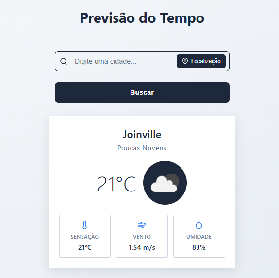

# 🌦️ Previsão do Tempo

## 🌐 Link da aplicação

 - [https://previsao-tempo-ic.vercel.app](https://previsao-tempo-ic.vercel.app)

## 💻 Prévia da aplicação



## ✨ Funcionalidades Principais

- 🔍 Busca por cidade manualmente ou localização automática
- 🌓 Tema claro e escuro
- 🌡️ Informações:
  - Temperatura atual
  - Sensação térmica
  - Umidade
  - Velocidade do vento
- 📅 Previsão para 5 dias

## 🛠️ Tecnologias Utilizadas

 - React
 - TypeScript
 - Vite
 - OpenWeather API

## ⚙️ Variáveis de ambiente
 - Necessário configurar uma key da [OpenWeather API](https://openweathermap.org/api) e adicionar a variável de ambiente: ``` VITE_WEATHER_API_KEY ```

## 🚀 Como Executar

```bash
  npm install
```
```bash
  npm run dev
```
